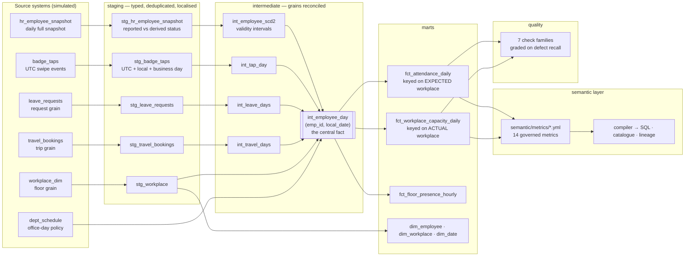
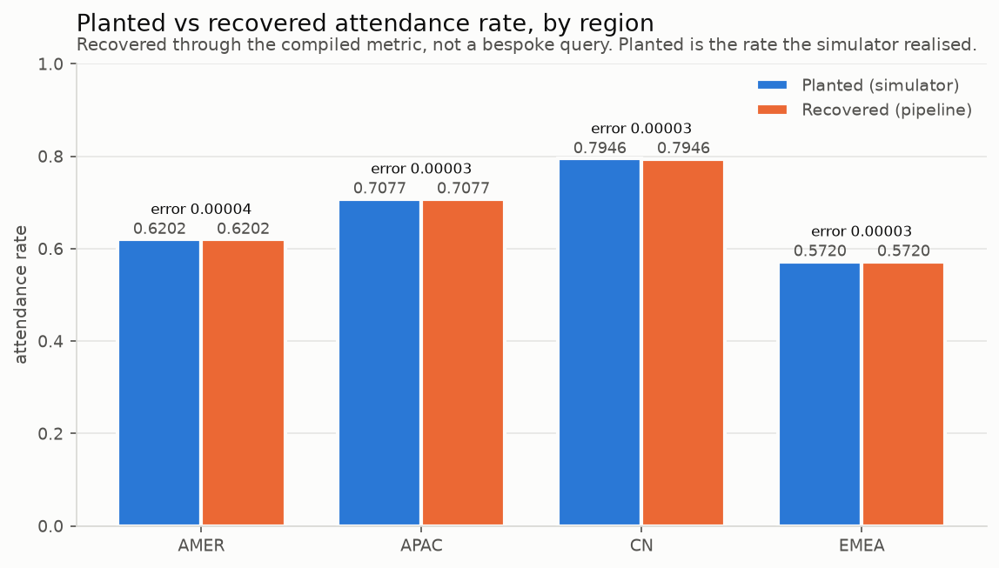
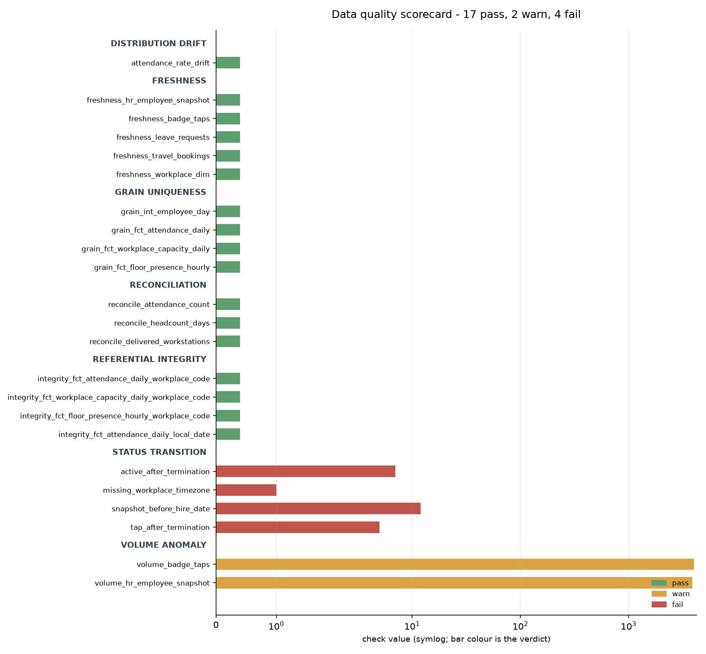
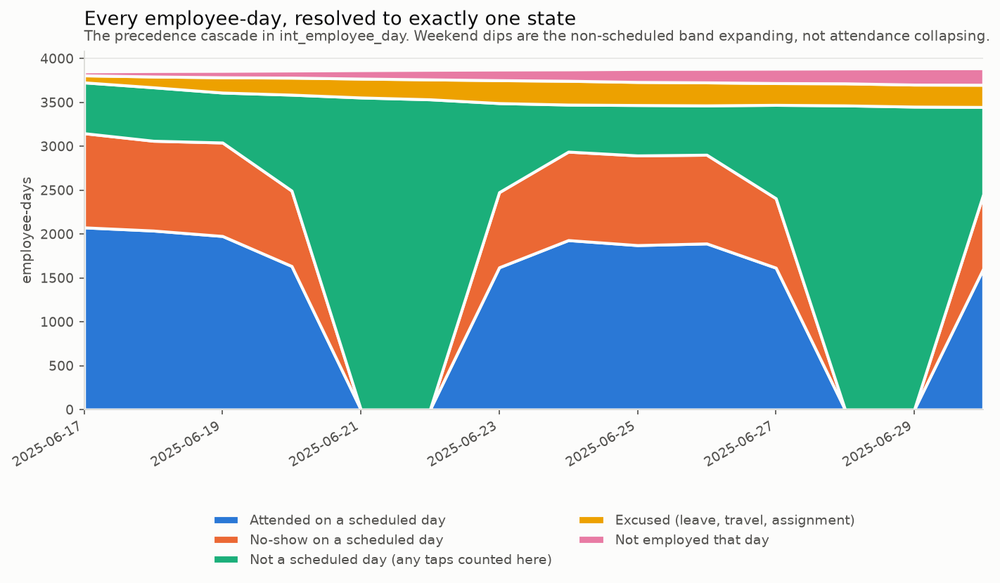
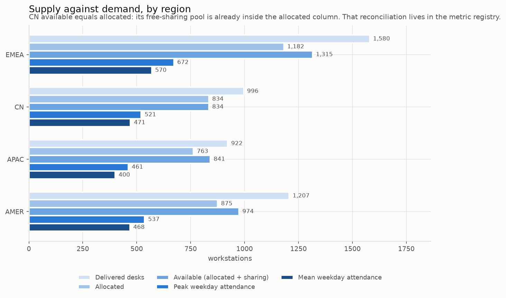
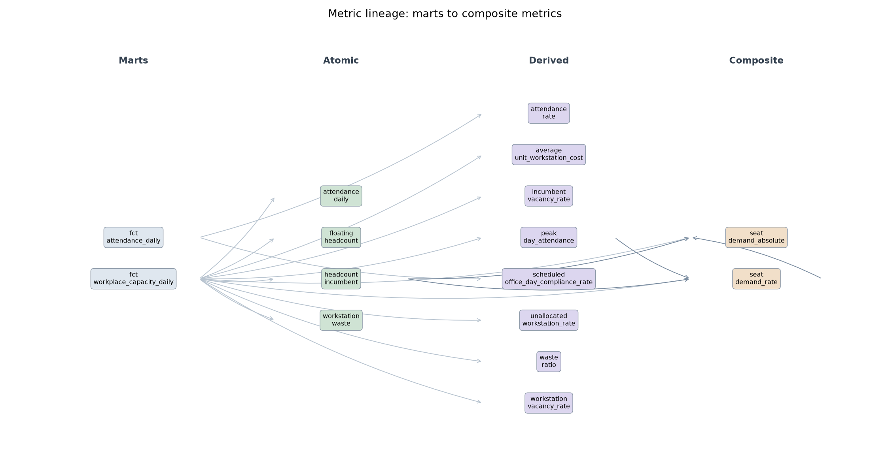

# workplace-data-platform

A dimensional warehouse and governed metric layer for global employee-presence data — five
disconnected source systems reconciled into one employee-day fact, with contract tests, lineage,
and a data quality suite that is graded on what it catches.

> **Synthetic data notice.** All data in this repository is programmatically generated. It
> contains no proprietary, confidential, or personal data, and no real operational figures.
> This is a reimplementation of analytical methodology on simulated data, built to demonstrate
> technique. Results shown are properties of the simulator, not of any organisation.

---

## Problem

A company with around 120,000 employees across 150 offices needs one answer to a simple-sounding
question: who was expected in which office, on which day, and did they come in. The data exists,
but it arrives from five systems that disagree about almost everything — the HR system publishes a
full daily snapshot, badge readers publish individual swipes in UTC, leave arrives at request
grain and is frequently amended after the fact, travel arrives per trip, and the space system
publishes one row per floor.

The result is the familiar failure: three dashboards, three attendance rates, all defensible.
Someone divided by scheduled days, someone else divided by employed days, and a third person
counted a night shift twice. Nobody is wrong, because nobody wrote the definition down anywhere
the query could read.

This repo builds the layer that makes that impossible: one fact table where precedence is resolved
once and recorded on the row, and one metric registry the SQL is compiled from rather than written
against.

---

## Architecture



Orchestrated by Dagster: five software-defined assets, one job that materialises the whole graph,
a daily schedule, and four asset checks — three of them blocking — on the tables everything else
depends on.

---

## Method

### 1. The precedence cascade

An employee-day can satisfy several conditions at once. A terminated employee can have an approved
leave request covering a day they also badged in on. Without a declared order, two teams resolve it
differently and both are defensible.

`int_employee_day` resolves every employee-day to **exactly one** state, in this order, and stores
the rule that fired as `state_rule_id`:

| # | State | Wins over everything below because |
|---|---|---|
| 1 | `post_exit` | They had left. No other fact about the day can be true. |
| 2 | `pre_hire` | They had not started. Same reasoning. |
| 3 | `on_leave` | An approved sick day during a booked trip is absence, not travel. |
| 4 | `on_travel` | A confirmed trip beats a posting; they are physically elsewhere. |
| 5 | `on_assignment` | Posted to another city for a period. |
| 6 | `non_office_day` | Not a scheduled office day for their division. |
| 7 | `attended` | A scheduled office day with a tap. |
| 8 | `no_show` | A scheduled office day, no tap, and no reason. |

Two denominators fall out of this, and keeping them apart is the single highest-value distinction
in the model:

- `is_scheduled_office_day` — the policy required attendance.
- `is_attendance_expected` — the policy required it **and** they were able to comply: employed,
  not on approved leave, not travelling, not posted elsewhere.

$$\text{attendance rate} = \frac{\sum \text{attendance\_expected\_met}}{\sum \text{attendance\_expected\_days}}$$

Dividing by scheduled days instead charges approved leave as a no-show. That is how this metric
gets quietly understated, and it is worth about two points here.

`employment_status_effective` is derived from hire and termination dates, never from the status HR
reported. The reported value is kept alongside it, so the disagreement between them is measurable
rather than absorbed — which is exactly what the DQ layer measures.

### 2. Timezones and the business day

Taps are stored in UTC; attendance is a local-day concept. Three rules, all in `stg_badge_taps`:

- **Both timestamps are carried.** Local date is derived from the local one.
- **A missing timezone falls back to UTC and sets a flag.** It does not guess a zone from the
  country — a wrong guess produces a confidently wrong local date, while an explicit fallback
  produces a number somebody can choose to distrust.
- **An exit inherits the business day of the entry it follows**; an entry before 04:00 local
  belongs to the previous day.

The third rule is the interesting one. A clock cutover alone was implemented first, and attendance
still ran about two points high in every region: a shift ending at 05:30 falls *after* a 04:00
cutover and opens a second business day for the same person. No cutover hour fixes this — there is
no time that is both after every night shift ends and before every early start begins. Anchoring to
the preceding entry has no boundary to get wrong, and holds for a shift of any length.

With it in place, the recovered attendance rate equals the simulator's realised rate **exactly** —
numerator and denominator, in all four regions.

### 3. Metric composition across grains

Every metric declares how it composes, because the two kinds of aggregation are different and
collapsing them into one `GROUP BY` mixes them up:

| Composition | Applies across | Example |
|---|---|---|
| `time_composition` | the days inside a period | headcount `avg`, peak `max`, event counts `sum` |
| entity composition | workplaces inside a group | additive measures sum; ratios recompute from components |

The compiler therefore emits three levels — the metric's own expression per workplace-day, composed
across days, then composed across workplaces:

```sql
with daily as (          -- per (workplace, day): the metric's expression
    ...
), per_workplace as (    -- per (workplace, period): time_composition
    select workplace_code, period, max(peak_day_attendance) as peak_day_attendance ...
)
select period, region, sum(peak_day_attendance) ...   -- across workplaces
```

Done in one flat pass, seat demand divides one workplace's busiest day by a whole week of
everybody's headcount and reports a sharing ratio of 0.05. Summing a headcount over five days gives
a number five times too large that still looks entirely plausible on a chart.

$$\text{seat demand rate} = \frac{\text{peak day attendance}}{\text{incumbent headcount}} \times (1 + \text{buffer})$$

`seat_demand_rate` is a **composite**: it references `peak_day_attendance` and
`headcount_incumbent` by name rather than restating their SQL, so it cannot drift from the numbers
the rest of the platform uses. `seat_demand_absolute` is a composite of that composite, which means
the buffer is applied once and cannot be applied twice by accident.

### 4. The China reconciliation

The CN space system reports the free-sharing desk pool *inside* `allocated_workstations`. Everywhere
else the columns are disjoint. The column names are identical, so adding them everywhere overstates
CN capacity by ~8% with no error at all — the query runs, the types match, the number is wrong.

The registry declares the variant and the compiler substitutes it **at row level, inside the
aggregate**:

```sql
sum(case when region = 'CN'
         then allocated_workstations
         else allocated_workstations + free_sharing_workstations end) - sum(attendance_actual)
```

Not a `CASE` wrapped around `sum(...)`. That form is correct only while `region` happens to be in
the `GROUP BY`; group by city and one branch is silently chosen for a group that may contain both
semantics. This is the difference between a reconciliation that holds at every grain and one that
holds until someone changes a filter.

### 5. Data quality, graded rather than displayed

Seven check families — freshness against per-source SLAs, referential integrity, grain uniqueness,
status-transition legality, attendance drift by PSI, mart-versus-staging reconciliation, and
weekday-aware volume anomalies. Every result carries a status, the number behind it, and a sentence
somebody can act on: `check_47 FAILED` gets ignored, *"5 people badged in more than 7 days after
their last working day — their access was never revoked"* does not.

Two things stop it being a wall of green ticks:

- **Defect recall.** The generator writes exactly what it injected to
  `data/raw/_defect_manifest.json`, and the suite is scored against it. A passing scorecard on its
  own proves only that the checks ran.
- **`conf/dq_expectations.yml`.** The checks that are *expected* to fail — because the simulator
  plants those defects on purpose — are recorded with an owner, a reason and a review date. The
  run exits non-zero only on an unexpected failure, and reports a suppression whose check has
  started passing as **stale**, because an entry nobody removes is how a real failure gets hidden
  later.

---

## Results on synthetic data

All figures are properties of the simulator, from `conf/sim.yaml` with seed `20240917` on the
14-day demo profile. "Planted" is the rate the simulator **realised**, not the rate requested in
the config — eligibility, leave and travel move one from the other, and comparing against the
request would report simulator behaviour as pipeline error.

### Planted vs recovered

| Region | Configured | Planted (realised) | Recovered | Absolute error |
|---|---|---|---|---|
| AMER | 0.6200 | 0.6202 | 0.6202 | 0.00004 |
| APAC | 0.7100 | 0.7077 | 0.7077 | 0.00003 |
| CN   | 0.7900 | 0.7946 | 0.7946 | 0.00003 |
| EMEA | 0.5800 | 0.5720 | 0.5720 | 0.00003 |

Recovered through the compiled metric — not a bespoke query written to match. The residual error is
rounding in the stored ground truth, which is written to four decimal places.



### Defect recall

| Planted defect | Injected | Detected | Caught |
|---|---|---|---|
| HR: resigned employees still reported active | 1 | 1 | yes |
| HR: snapshot rows before the employee's hire date | 12 | 12 | yes |
| Space: workplaces with no timezone | 1 | 1 | yes |
| Badge: people badging after termination | 27 | 27 | yes |

4 of 4 defect classes detected, detected counts equal to injected counts. 23 checks: 16 pass,
3 warn, 4 fail — **0 unexpected**, every failure being a planted defect with a written reason.



### The model working



Every employee-day lands in exactly one band. The weekday/weekend swing is the non-scheduled band
expanding, not attendance collapsing — which is the point of resolving absence into reasons rather
than leaving it as a gap.



CN's available capacity equals its allocated capacity, because its free-sharing pool is already
inside that column. That reconciliation lives in the registry, applied per row.



### Scale

`make demo` runs the whole pipeline — generate, load, build, compile, check, chart — in about
**12 seconds** on the demo profile. The `full` profile in the same config generates ~35M badge taps
over 180 days for 120,000 employees; generation is vectorised per day and written as daily Parquet
partitions, so memory stays flat at any profile size and the same code path serves both.

---

## How to run

```bash
make setup     # uv venv + install (Python 3.11+, no credentials, fully offline)
make demo      # generate → load → dbt build → compile metrics → DQ → charts → results table
make dashboard # Streamlit: metric catalogue, lineage, DQ scorecard
make test      # 55 tests, including one end-to-end smoke test
```

`WDP_PROFILE=full make pipeline` runs the same graph at 120k employees over 180 days.

---

## Design decisions and trade-offs

- **The central fact is employee-day, not tap-grain.** Tap grain is smaller and lossless, but it
  cannot represent an absence — a no-show has no row — so every absence question becomes an
  anti-join against a population derived somewhere else. Employee-day costs ~21.6M rows at full
  scale and buys absence as a countable state. *(ADR 1)*

- **A business day is anchored to its entry tap, not to a clock cutover.** The cutover was built
  first and left attendance two points high; no cutover hour separates a night shift ending at
  05:30 from an early start beginning at 03:00. Accepted cost: a genuine pre-dawn arrival is filed
  to the previous day. *(ADR 2)*

- **A YAML registry alongside dbt metrics, not instead of them.** dbt metrics live next to the
  models and cannot reference a missing column, which is usually enough. What it does not give is
  the reverse check — a measure in a governed fact table that *no* metric claims. That direction is
  what stops a catalogue rotting, because it fails at the moment the measure is added, which is the
  only moment when writing the definition is cheap. *(ADR 4)*

- **Regional variants are substituted per row, inside the aggregate.** Wrapping a `CASE` around
  `sum(...)` is simpler and is correct only while region is in the `GROUP BY`. Rejected because the
  failure is silent and arrives the first time someone groups by city. *(ADR 3)*

- **A missing timezone falls back to UTC and raises a flag, rather than inferring one from the
  country.** Inference gives a confidently wrong local date for an entire workplace; the flag gives
  a number somebody can distrust, and the DQ check reports how many desks are affected.

- **Waivers are a feature of the governance check, not a hole in it.** A check that cannot be
  satisfied gets switched off, so `semantic/unregistered_measures.yml` lets a measure be declared
  "not a metric" in writing, with an owner and a reason. An empty reason fails validation, and so
  does a waiver for a column that has since been dropped.

- **Pandera contracts are kept separate from data quality checks.** A contract failure means the
  *code* is wrong and should stop the pipeline; a DQ failure means the *data* is wrong and should
  be scored and sometimes tolerated. Merging them would force the pipeline to halt on a defect that
  the business has already decided to live with.

- **dbt is invoked as a subprocess rather than through `dagster-dbt`.** Per-model assets in the
  Dagster UI would be nicer, at the cost of pinning the two tools together. For a repo whose
  subject is the modelling rather than the orchestration, the subprocess is the honest trade — it
  is the same command a developer runs by hand.

---

## What I would do differently at production scale

- **DuckDB is a single-node stand-in.** At 120k employees the employee-day fact is ~21.6M rows per
  180 days and DuckDB handles it comfortably, but there is no concurrency story, no separation of
  storage and compute, and no way to let a hundred analysts query it at once. The models are
  deliberately plain SQL so the same graph runs on Snowflake or BigQuery, but the incremental
  strategy would need rewriting — every model here is a full rebuild.

- **The central fact should be incremental and partitioned.** Rebuilding every employee-day nightly
  is fine at this scale and wasteful at ten times it. The real version is partitioned by local date
  with a late-arriving-data window, which the 3% of badge rows reported a day late already argues
  for.

- **The DQ suite samples nothing.** Every check is a full scan. At production volume the
  distribution and volume checks would run on sampled or pre-aggregated inputs, and the
  reconciliation checks — which are the expensive ones and the most valuable — would run on a
  schedule rather than on every materialisation.

- **PSI is a weak drift detector and I would not rely on it alone.** It needs enough observations
  per bucket to mean anything; this implementation caps its bucket count by sample size and reports
  insufficient history rather than inventing confidence, but the honest upgrade is a distributional
  test with a real null hypothesis, plus per-city control charts.

- **The access protocol is declared, not enforced.** Metrics carry a sensitivity tier, and nothing
  in this repo checks who is asking. A production version enforces row-level filters and column
  masking in the compiler — the tier is already there to enforce against.

- **The office-day policy is a static reference extract.** In reality it changes mid-quarter, per
  team, with exceptions, and schedule compliance is only meaningful against the policy that was in
  force on the day. That needs the same SCD2 treatment the HR snapshot already gets.

- **Simulated data cannot validate the thing that actually breaks.** Every defect here is one I
  chose to plant. Real feeds fail in ways nobody anticipated — a vendor changes a timezone
  convention without telling anyone, a badge reader is replaced and re-uses device IDs. The value
  of this repo is the framework for catching known failure classes; the unknown ones are found by
  reconciliation against an independent source, which is why the mart-versus-staging check is the
  one I would keep if I could only keep one.

---

## Repo map

```
conf/
  sim.yaml                  every number in the repo traces to this file
  dq_expectations.yml       checks expected to fail, with owner and review date
src/workplace_platform/
  config.py                 typed, validated config; scale profiles
  contracts.py              Pandera schemas at every module boundary
  gen/                      the six source systems, seeded and vectorised
    rng.py                  named substreams, so sources are independent
    employees.py            HR snapshot, SCD-style, with planted defects
    taps.py                 35M-row-capable badge feed, day by day
    leave.py travel.py workplaces.py run.py
  warehouse/loader.py       validate in pandas, load through DuckDB
  semantic/
    registry.py             the metric schema and its rules
    compile.py              registry → SQL, catalogue, lineage
    validate.py             two-way registry ↔ warehouse check
  dq/                       check registry, seven families, scorecard
  orchestration/            Dagster assets, job, schedule, asset checks
  reporting/                README charts and the make demo results table
dbt/
  models/staging/           typed, deduplicated, localised
  models/intermediate/      grains reconciled; int_employee_day
  models/marts/             facts and dimensions
  tests/                    5 singular tests for business rules
semantic/
  metrics/*.yml             14 metric definitions, one file each
  unregistered_measures.yml waivers, with owner and reason
  compiled/                 generated SQL (do not edit)
app/streamlit_app.py        catalogue search, lineage, DQ scorecard
docs/
  metrics.md                generated catalogue
  decisions/                4 ADRs
  img/                      charts, generated by a script
tests/                      55 tests, incl. one end-to-end smoke test
```

MIT licensed.
